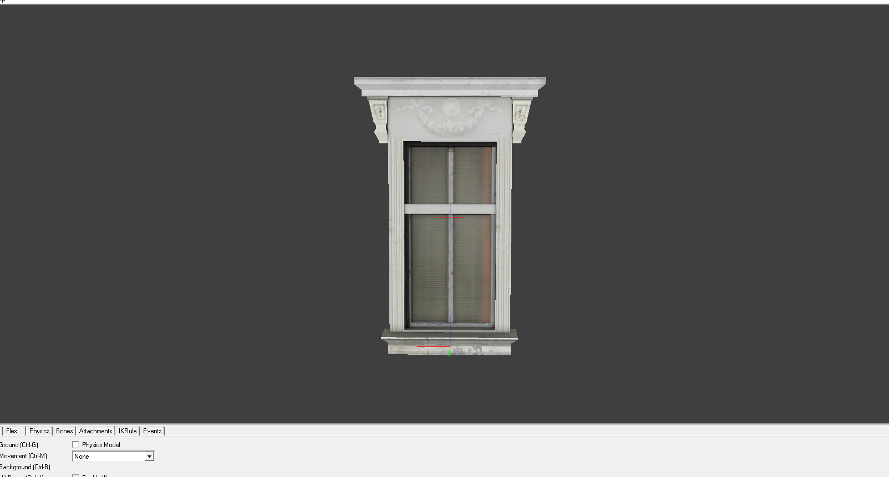
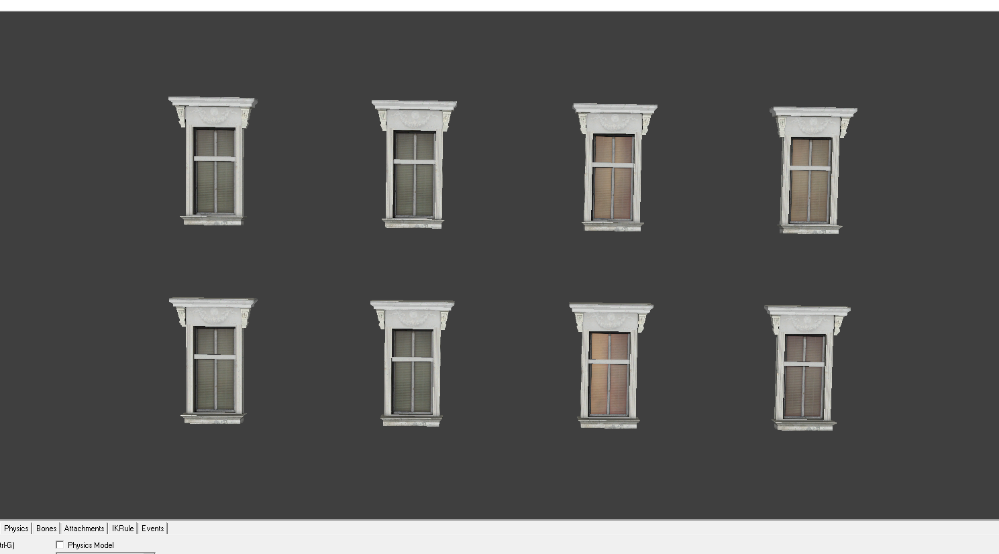
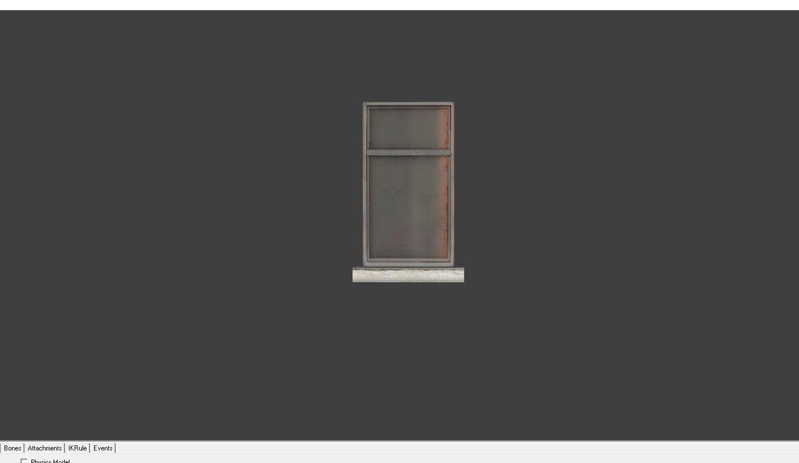
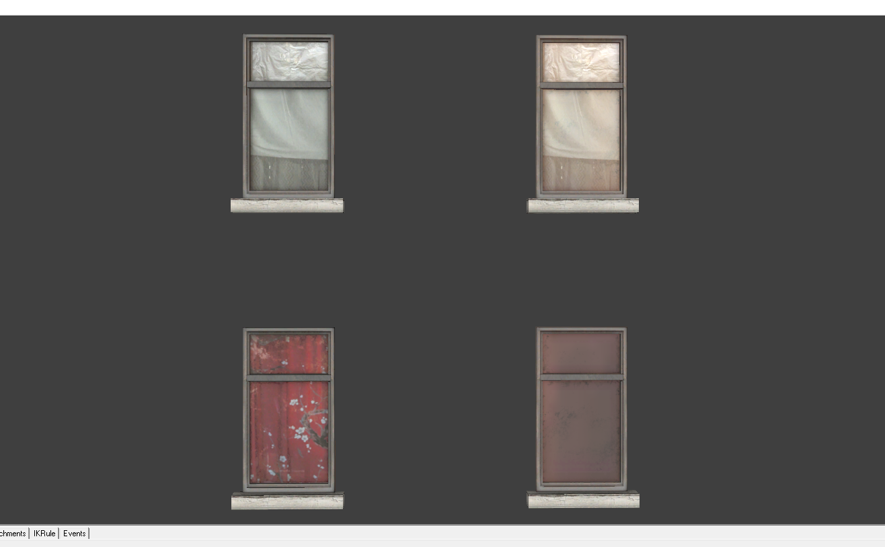
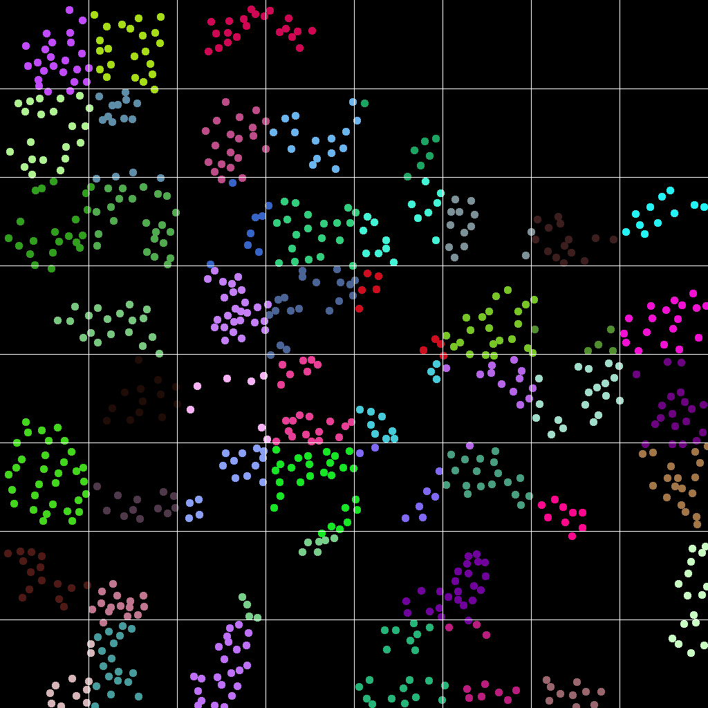
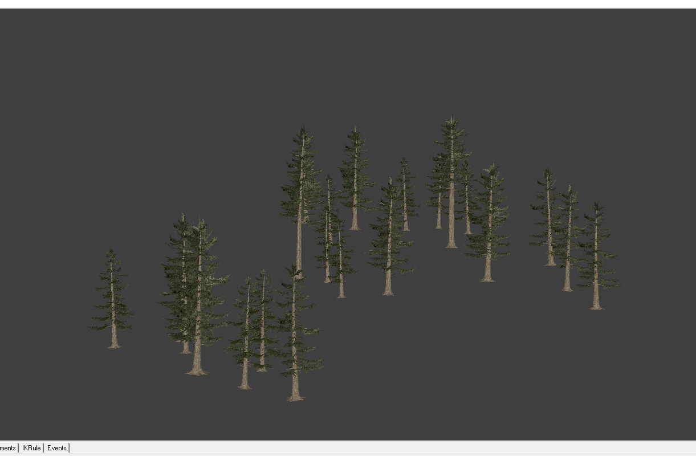

# Batched Model Compiling

## Objective
Many map developers in the Source modding community find it difficult to generate their own custom models for the levels they are working on. Utilities exist to decompile existing model files, but even the most basic editing of these decompiled models (such as creating duplicate objects using the mesh) requires 3d modeling knowledge and access to a 3d modeling software suite.

The objective of this project is to provide an easy to use utility for performing basic model manipulation.

## Current Features (WIP)

### Model Tiling
This feature can be used to take an existing model file and tile it. This is usefull for level details such as window frames. Tiling currently supports randomized assignment of materials to each model.
<table>
  <thead><tr><th>Base Model</th><th>Tiled Result</th></tr></thead>
  <tr><td></td><td></td></tr>
  <tr><td></td><td></td></tr>
</table>

### Model Clustering
Model clustering is a utility which allows a map developer to create clustered 3d models using hammer editor. The user can place objects in there level to their liking, and then use the Model Clustering Utility to generate 3d models using the meshes they currently have. This can yield some performance improvement (For example: in a map with a large forrest, 27 trees can be replaced with 1 larger 3d model consisting of all mesh data from all 27 trees).

The utility supports manual cluster setting (where the user sets what models will be assigned to a particular cluster using visgroups) or automatic clustering (where an algorithm assigns models to clusters, while abiding by certain constraints)

Above is an image showing a clustering pattern created by the application. Each colored dot represents a tree, and the color represents the group it belongs to.

Above is an image of one of the clusters generated by the application. In this case, the cluster is for a map with a large forrest.
